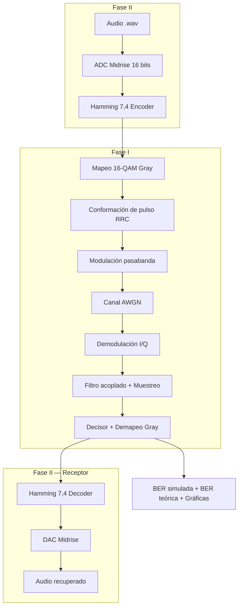

# Proyecto 16-QAM + Hamming(7,4) sobre Canal AWGN en MATLAB

Este repositorio contiene la simulación en MATLAB de un sistema completo de comunicaciones digitales basado en **16-QAM con mapeo Gray** sobre un **canal AWGN**. El proyecto está dividido en dos fases: la cadena base de modulación/demodulación (Fase I) y la incorporación de una fuente de audio real con codificación de canal Hamming(7,4) (Fase II).

---

## Descripción general

El sistema implementa una cadena completa de comunicaciones digitales:

**Fase I — Cadena base 16-QAM:**
- Generación de bits aleatorios.
- Mapeo 16-QAM Gray.
- Conformación de pulso RRC.
- Modulación pasabanda.
- Canal AWGN.
- Demodulación coherente I/Q.
- Filtro acoplado y muestreo óptimo.
- Decisor de mínima distancia.
- Demapeo Gray inverso.
- Cálculo de BER simulada y teórica.

**Fase II — Fuente de audio y codificación de canal:**
- Fuente de audio PCM (ADC Midrise 16 bits).
- Codificación Hamming(7,4) para corrección de errores.
- Cadena completa Fase I sobre los bits codificados.
- Decodificación Hamming por síndrome.
- Reconstrucción de audio (DAC Midrise).
- Comparación de BER con y sin codificación.

El objetivo es evaluar el desempeño del sistema 16-QAM Gray en presencia de ruido AWGN y analizar la ganancia de codificación del código Hamming(7,4), comparando BER simulada con BER teórica para distintos valores de $E_b/N_0$.

---

## Arquitectura general del sistema



---

## Relación entre bloques y archivos MATLAB

### Fase I

| Bloque | Archivo | Función dentro del sistema |
|---|---|---|
| Configuración | `FASE_1/config_sistema.m` | Centraliza todos los parámetros del sistema con validaciones. |
| Bits + Mapeo | `FASE_1/Transmisor/modulador_binario_16qam.m` | Genera bits (o acepta externos) y los mapea a símbolos 16-QAM Gray normalizados. |
| Filtro RRC | `FASE_1/Transmisor/filtro_coseno_alzado_raiz.m` | Diseño analítico del filtro raíz de coseno alzado. |
| Conformación de pulso | `FASE_1/Transmisor/conformacion_pulso.m` | Upsampling y convolución con el RRC del transmisor. |
| Modulación pasabanda | `FASE_1/Transmisor/modulacion_pasabanda.m` | Traslada la señal banda base a $f_c$ usando ramas I y Q. |
| Canal AWGN | `FASE_1/Canal/canal_awgn.m` | Agrega ruido AWGN calibrado a partir de $E_b/N_0$. |
| Demodulación | `FASE_1/Receptor/demodulador_16qam.m` | Down-conversion, filtro acoplado, muestreo, decisor y demapeo. |
| BER | `FASE_1/Receptor/calculo_ber.m` | Calcula BER simulada (conteo) y teórica analítica. |
| Gráficas | `FASE_1/Visualizacion/graficas_simulacion.m` | BER, constelación, diagrama de ojo y espectro. |
| Pruebas | `FASE_1/Pruebas/pruebas_unitarias.m` | Suite de pruebas automáticas de la Fase I. |

### Fase II

| Bloque | Archivo | Función dentro del sistema |
|---|---|---|
| Configuración | `FASE_2/config_fase2.m` | Parámetros de audio, ADC/DAC y Hamming con validaciones. |
| Audio de prueba | `FASE_2/Audio/generar_audio_prueba.m` | Genera acorde 440+659+880 Hz con envolvente ADSR. |
| ADC | `FASE_2/Fuente/conversor_adc.m` | Cuantificador Midrise uniforme de B bits, salida PCM binaria. |
| DAC | `FASE_2/Fuente/conversor_dac.m` | Reconstrucción inversa: bits PCM → muestras de audio. |
| Codificador Hamming | `FASE_2/CodificacionErrores/codificador_hamming.m` | Código sistemático Hamming(7,4) en GF(2). |
| Decodificador Hamming | `FASE_2/CodificacionErrores/decodificador_hamming.m` | Síndrome + tabla de corrección, implementación vectorizada. |
| BER codificada | `FASE_2/calculo_ber_codificado.m` | BER teórica con y sin codificación desde primeros principios. |
| Gráficas | `FASE_2/Visualizacion/graficas_fase2.m` | 4 curvas BER comparativas y comparación de audio (PSD manual). |
| Pruebas | `FASE_2/Pruebas/pruebas_fase2.m` | 6 tests automáticos incluyendo pipeline completo a 100 dB. |
| Orquestador | `FASE_2/main_fase2.m` | Ejecuta la simulación completa de la Fase II. |

---

## Características principales

- Modulación **16-QAM Gray** bidimensional con constelación rectangular.
- Canal **AWGN** con calibración precisa de varianza desde $E_b/N_0$.
- Modulación y demodulación pasabanda coherente.
- Conformación de pulso **RRC** (β = 0.35) implementada analíticamente.
- Filtro acoplado en recepción: maximiza SNR y cumple criterio de Nyquist.
- Muestreo óptimo con compensación de retardo total $2 \cdot \text{span} \cdot \text{sps}$.
- Cuantificación uniforme **Midrise** de 16 bits (SNDR ≈ 98.1 dB).
- Código corrector **Hamming(7,4)**: corrige 1 error por cada 7 bits.
- Decodificación por síndrome completamente vectorizada.
- Curvas BER con y sin codificación: teóricas y simuladas.
- Gráficas de BER, constelación, diagrama de ojo, espectro y comparación de audio.
- Implementación **sin Communications Toolbox** — todo desde primeros principios matemáticos.
- Reproducibilidad garantizada con `rng(2026)`.

---

## Estructura del proyecto

```text
CANAL_AWGN_CD/
│
├── FASE_1/
│   ├── Canal/
│   │   └── canal_awgn.m
│   ├── Pruebas/
│   │   └── pruebas_unitarias.m
│   ├── Receptor/
│   │   ├── calculo_ber.m
│   │   └── demodulador_16qam.m
│   ├── Transmisor/
│   │   ├── conformacion_pulso.m
│   │   ├── filtro_coseno_alzado_raiz.m
│   │   ├── modulacion_pasabanda.m
│   │   └── modulador_binario_16qam.m
│   ├── Visualizacion/
│   │   └── graficas_simulacion.m
│   ├── config_sistema.m
│   └── main_simulacion.m
│
├── FASE_2/
│   ├── Audio/
│   │   └── generar_audio_prueba.m
│   ├── CodificacionErrores/
│   │   ├── codificador_hamming.m
│   │   └── decodificador_hamming.m
│   ├── Fuente/
│   │   ├── conversor_adc.m
│   │   └── conversor_dac.m
│   ├── Pruebas/
│   │   └── pruebas_fase2.m
│   ├── Visualizacion/
│   │   └── graficas_fase2.m
│   ├── calculo_ber_codificado.m
│   ├── config_fase2.m
│   └── main_fase2.m
│
└── README.md
```

---

## Parámetros principales

Los parámetros del sistema se definen en `config_sistema.m` (Fase I) y `config_fase2.m` (Fase II).

### Fase I

| Parámetro | Valor | Descripción |
|---|---|---|
| `M` | 16 | Orden de la constelación QAM. |
| `k = log2(M)` | 4 | Bits por símbolo. |
| `sps` | 8 | Muestras por símbolo. |
| `span` | 6 | Duración del filtro RRC en símbolos. |
| `beta` | 0.35 | Factor de roll-off del filtro RRC. |
| `fc` | 2 Hz | Frecuencia portadora (normalizada). |
| `fs` | 8 Hz | Frecuencia de muestreo (`= sps / Ts`). |
| `EbNo_dB` | 0 a 14 dB | Rango del barrido de BER. |
| `semilla` | 2026 | Semilla aleatoria para reproducibilidad. |

### Fase II

| Parámetro | Valor | Descripción |
|---|---|---|
| `B` | 16 bits | Resolución del ADC/DAC Midrise. |
| `fs_audio` | 44 100 Hz | Frecuencia de muestreo del audio. |
| `hamming_n` | 7 | Longitud de la palabra código. |
| `hamming_k` | 4 | Bits de datos por palabra código. |
| `hamming_t` | 1 | Capacidad de corrección (errores). |
| `r` | 4/7 ≈ 0.571 | Tasa del código. |
| `penalización` | −2.43 dB | `10·log10(4/7)` — penalización en $E_b/N_0$. |
| `EbNo_audio` | 12 dB | $E_b/N_0$ para recuperación del audio completo. |

---

## Parámetros calculados

```text
k = log2(M) = log2(16) = 4 bits/símbolo
```

```text
Retardo total del sistema = 2 × span × sps = 2 × 6 × 8 = 96 muestras
```

```text
SNDR cuantificación (Midrise, B=16) = 6.02×16 + 1.76 ≈ 98.1 dB
```

```text
Penalización Hamming(7,4) = 10·log10(4/7) ≈ -2.43 dB
```

```text
Ec/N0 = r · Eb/N0  →  Ec/N0 [dB] = Eb/N0 [dB] - 2.43 dB
```

```text
Eficiencia espectral = k / (1 + β) = 4 / 1.35 ≈ 2.96 bps/Hz
```

---

## Mapeo 16-QAM Gray

La modulación 16-QAM se construye como el producto cartesiano de dos modulaciones 4-PAM:

```text
16-QAM = 4-PAM en I × 4-PAM en Q
```

Los niveles usados por dimensión son:

```text
I, Q ∈ {-3, -1, +1, +3}
```

El símbolo complejo se define como:

```text
s = I + jQ
```

El mapeo Gray por dimensión es:

```text
00 → -3
01 → -1
11 → +1
10 → +3
```

Este mapeo garantiza que símbolos vecinos difieran en un solo bit, minimizando la BER cuando el ruido provoca una decisión hacia el símbolo adyacente.

---

## Normalización de la constelación

La constelación se normaliza para obtener energía promedio de símbolo unitaria.

Energía promedio por dimensión:

```text
E[I²] = [(-3)² + (-1)² + 1² + 3²] / 4 = (9+1+1+9)/4 = 5
```

Energía total del símbolo complejo:

```text
Es = E[I²] + E[Q²] = 5 + 5 = 10
```

Factor de normalización:

```text
s_norm = (I + jQ) / sqrt(10)
```

En el código:

```matlab
factor_normalizacion = sqrt(10);
simbolos = (amplitudes_I + 1j*amplitudes_Q) / factor_normalizacion;
```

---

## Conformación de pulso RRC

Los símbolos discretos se convierten en una forma de onda continua mediante:

```text
x(t) = Σ s_n · p(t - nT)
```

Se usa un filtro raíz de coseno alzado (RRC) con β = 0.35, implementado analíticamente resolviendo las singularidades en $t = 0$ y $t = \pm T/(2\beta)$.

La cascada de los dos filtros RRC (transmisor y receptor) produce el filtro de coseno alzado (RC), que satisface el criterio de Nyquist:

```text
g(kT) = δ[k]   →   ISI = 0 en los instantes de muestreo
```

El filtro acoplado en recepción maximiza la SNR por el teorema de Cauchy-Schwarz.

---

## Modulación pasabanda

La señal pasabanda real se construye desde las componentes banda base I y Q:

```text
s_pb(t) = I(t)·cos(2πfct) − Q(t)·sin(2πfct)
```

En el receptor, la bajada de pasabanda se realiza con:

```text
I_demod(t) = s_pb(t) · 2cos(2πfct)  →  I(t) + réplica en 2fc  (eliminada por RRC)
Q_demod(t) = s_pb(t) · −2sin(2πfct) →  Q(t) + réplica en 2fc  (eliminada por RRC)
```

El factor ×2 cancela el ½ que aparece al multiplicar coseno por coseno, devolviendo la amplitud original.

---

## Canal AWGN

El canal se modela como:

```text
Y(t) = X(t) + Z(t)
```

La varianza del ruido se calibra desde $E_b/N_0$:

```text
σ² = Ps · sps / (2 · k · (Eb/N0)_lineal)
```

donde $P_s = \text{mean}(s_{pb}^2)$ es la potencia medida de la señal transmitida.

Para el sistema con codificación Hamming, el canal recibe la energía por bit codificado:

```text
Ec/N0 = r · Eb/N0  →  Ec/N0 [dB] = Eb/N0 [dB] + 10·log10(4/7)
```

Esto garantiza una comparación justa: ambos sistemas gastan la misma energía total por bit de datos.

---

## Cuantificación ADC/DAC (Fase II)

Se usa un cuantificador **Midrise uniforme** de B = 16 bits sobre el rango [−1, +1]:

```text
L = 2^16 = 65 536 niveles
Δ = 2/L ≈ 30.5 μV
```

**ADC** — muestra → índice → bits:

```text
q = floor((x + 1) / Δ)      →   índice en [0, L-1]
bits = descomposición binaria big-endian de q
```

**DAC** — bits → índice → muestra:

```text
q = bits · [2^(B-1); ...; 2^0]
x_q = q · Δ - 1 + Δ/2       →   centro del intervalo de cuantificación
```

SNDR teórico para señal sinusoidal de amplitud plena:

```text
SNDR = 6.02·B + 1.76 dB = 6.02×16 + 1.76 ≈ 98.1 dB
```

---

## Código Hamming(7,4) (Fase II)

El código **Hamming(7,4)** es un código lineal de bloque con parámetros:

```text
n = 7   (bits por palabra código)
k = 4   (bits de datos)
t = 1   (errores corregibles por palabra)
r = 4/7 (tasa del código)
```

**Codificación:**

```text
c = mod(m · G, 2)
```

donde G es la matriz generadora sistemática $[I_4 | P]$.

**Decodificación por síndrome:**

```text
s = mod(r · H^T, 2)
posición del error = tablon_sindrome[s en decimal]
```

Las columnas de H son los números 1 a 7 en binario, de modo que el síndrome decimal apunta directamente a la posición del error.

**Código perfecto:** Hamming(7,4) satisface la cota de Hamming con igualdad exacta:

```text
2^k · (C(n,0) + C(n,1)) = 2^4 · (1 + 7) = 128 = 2^7 = 2^n  ✓
```

---

## Curvas BER

### Sin codificación (16-QAM Gray)

```text
BER = (4/k)·(1 − 1/√M)·Q(√(3k·Eb/N0/(M−1)))
```

Para M=16, k=4:

```text
BER = (3/4)·Q(√(0.8·Eb/N0))
```

### Con codificación Hamming(7,4)

```text
BER_cod ≈ (1/k) · Σ_{j=2}^{7} j · C(7,j) · p^j · (1-p)^(7-j)
```

donde `p` es la BER del canal evaluada en `Ec/N0 = r·Eb/N0`.

La función Q se implementa sin toolbox:

```matlab
funcion_Q = @(x) 0.5 * erfc(x / sqrt(2));
```

---

## Cómo ejecutar el proyecto

### Fase I

1. Abrir MATLAB y navegar a la carpeta raíz del repositorio.
2. Ejecutar el script principal:

```matlab
cd FASE_1
main_simulacion
```

### Fase II

```matlab
cd FASE_2
main_fase2
```

En la primera ejecución se genera automáticamente el archivo `audio_prueba.wav`.

---

## Gráficas generadas

### Fase I

**1. BER vs Eb/N0**

Comparación entre BER simulada y BER teórica en escala logarítmica.

Conclusión esperada:
```text
La BER simulada debe converger a la curva teórica al aumentar Eb/N0.
```

**2. Diagrama de Constelación**

Puntos I-Q recibidos tras el filtro acoplado y antes del decisor.

Conclusión esperada:
```text
Deben observarse 16 agrupamientos alrededor de los puntos ideales.
```

**3. Diagrama de Ojo**

Visualización temporal de la señal banda base tras el filtro acoplado.

Conclusión esperada:
```text
Ojo abierto en los instantes de muestreo indica ISI nula (criterio Nyquist).
```

**4. Espectro de la señal pasabanda**

PSD calculada con FFT y ventana Hann, sin usar `pwelch`.

Conclusión esperada:
```text
El espectro debe aparecer centrado en ±fc con ancho de banda Rs·(1+β).
```

### Fase II

**1. Curvas BER comparativas (4 curvas)**

BER teórica y simulada, con y sin codificación Hamming(7,4).

Conclusión esperada:
```text
Las curvas se cruzan ~6 dB. Por debajo el código empeora (penalización de tasa).
Por encima el código mejora significativamente (ganancia de codificación).
```

**2. Comparación de audio**

Forma de onda y espectro de potencia (PSD con ventana Hann) del audio original vs recuperado.

Conclusión esperada:
```text
A Eb/N0 = 12 dB las formas de onda son prácticamente idénticas.
SNR de reconstrucción ≈ 98 dB (limitado por cuantificación, no por canal).
```

---

## Restricciones cumplidas

El proyecto **no usa** ninguna función de Communications Toolbox ni de Signal Processing Toolbox para las funciones centrales:

| Función prohibida | Alternativa implementada |
|---|---|
| `qammod` / `qamdemod` | `modulador_binario_16qam.m` / `demodulador_16qam.m` |
| `rcosdesign` | `filtro_coseno_alzado_raiz.m` (analítico) |
| `awgn` | `canal_awgn.m` (calibración manual de σ²) |
| `encode` / `decode` | `codificador_hamming.m` / `decodificador_hamming.m` |
| `hammgen` | Matrices G y H construidas manualmente |
| `pwelch` | FFT + ventana Hann implementada con `cos` |
| `eyediagram` / `scatterplot` | `graficas_simulacion.m` con `plot` estándar |

---

## Validación del sistema

El sistema se valida mediante:

- Disminución de BER al aumentar $E_b/N_0$ en ambas fases.
- Convergencia de BER simulada a la curva teórica.
- Formación de 16 agrupamientos en la constelación recibida.
- Diagrama de ojo abierto en los instantes de muestreo.
- Espectro centrado en $\pm f_c$ con ancho de banda correcto.
- Cruce de curvas BER codificada/no codificada alrededor de 6 dB.
- Corrección de errores Hamming validada en las 7 posiciones posibles.
- Roundtrip ADC/DAC sin pérdida de información en canal ideal.
- Reproducibilidad total con `rng(2026)`.

---

## Ideas clave

- 16-QAM es una modulación bidimensional: usa ramas I y Q simultáneamente.
- Cada símbolo transporta $k = \log_2(16) = 4$ bits.
- El código Gray garantiza que decisiones erróneas al vecino más cercano solo cambian 1 bit de los 4.
- El factor $1/\sqrt{10}$ normaliza $E_s = 1$ y no cambia la geometría de la constelación.
- $f_c = 2$ Hz es una frecuencia portadora normalizada de simulación; en un sistema real sería del orden de GHz.
- Si la BER queda cerca de 0.5, revisar: retardo del filtro acoplado, instante de muestreo, factor de modulación y sincronización.
- La penalización Hamming ($-2.43$ dB) hace que el sistema codificado reciba menos energía por bit — por eso la curva CC empieza peor.
- La ganancia de codificación aparece a alta SNR porque los errores aislados son corregibles; a baja SNR dominan los errores dobles no corregibles.
- El SNDR de 98.1 dB del ADC de 16 bits es el límite de calidad del audio — el canal solo empeora esto; nunca lo mejora.
